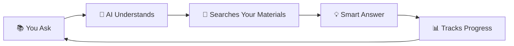

<div align="center">

# 🛡️ S2-Sentinel Copilot

### *Your AI-Powered Study Companion for Cybersecurity Excellence*

**Built for Howest University Belgium 🇧🇪 • CS Engineering Semester 2**

<br>


<br>


</div>

---

## ✨ What Makes S2-Sentinel Special?

Imagine having a **personal AI tutor** that:
- 🧠 **Understands** your specific courses and teaching styles
- 📚 **Learns** from your uploaded study materials
- 🎯 **Adapts** to your learning pace and preferences
- 🛠️ **Provides** 24+ specialized tools for hands-on practice
- 📊 **Tracks** your progress with intelligent analytics
- 🎨 **Looks** stunning with 12 beautiful themes

**S2-Sentinel Copilot isn't just another study app — it's your intelligent study partner!**

---

## 🎓 Your Course Arsenal

<table>
<tr>
<td width="50%">

### 🔵 **Technical Mastery**
- **Computer Networks** (6 ECTS)
  - *Packet-First Learning*
- **Web Backend Development** (3 ECTS)
  - *Code-First Approach*
- **Scripting & Code Analysis** (6 ECTS)
  - *Annotated Code Style*

</td>
<td width="50%">

### 🔴 **Security Expertise**
- **Web Pentesting** (3 ECTS)
  - *Attack-Chain Method*
- **Linux for Ethical Hackers** (6 ECTS)
  - *CLI-First Training*
- **Capture The Flag** (3 ECTS)
  - *Hint-Ladder System*

</td>
</tr>
<tr>
<td colspan="2">

### 🌟 **Professional Skills**
- **Data Privacy & IT Law** (3 ECTS) • *Case-Based Learning*
- **AI Security** (3 ECTS) • *Threat-Model Analysis*

</td>
</tr>
</table>

---

## 🚀 Get Started in 60 Seconds

### Step 1️⃣ : Open the App
```
Simply open index.html in your browser - No installation needed!
```

### Step 2️⃣ : Get Your Free API Key
Choose your AI provider (both are free!):
- 🚄 **[Cerebras](https://cloud.cerebras.ai/)** - Lightning fast (Recommended!)
- 🧠 **[Google AI Studio](https://aistudio.google.com/apikey)** - Powerful & free

### Step 3️⃣ : Start Learning
1. 📖 Select your subject
2. 📄 Upload your study materials (PDFs)
3. 💬 Ask questions and get smart answers
4. 🛠️ Use specialized tools
5. 📊 Track your progress

**That's it! You're ready to ace your exams! 🎯**

---

## 🎨 Beautiful Themes for Every Mood

Choose from **12 stunning themes** that match your vibe:

| 🌟 Premium | 🌈 Colorful | 🌙 Dark | ☀️ Light |
|------------|-------------|---------|-----------|
| Glass (Default) | Cyber | Sentinel-Dark | Light |
| Aurora | Ocean | Midnight | - |
| Nebula | Sunset | Hacker | - |
| - | Forest | - | Lavender |

*Switch themes anytime with one click!*

---

## 💡 Powerful Features

<table>
<tr>
<td width="33%" align="center">

### 🤖 **Smart AI**
Context-aware responses<br>
Upload PDFs for custom learning<br>
Multi-model support

</td>
<td width="33%" align="center">

### 🛠️ **24+ Tools**
Subnet Calculator<br>
JWT Decoder<br>
Regex Tester<br>
*...and many more!*

</td>
<td width="33%" align="center">

### 📊 **Analytics**
Study time tracking<br>
Quiz performance<br>
Weak topic detection

</td>
</tr>
<tr>
<td width="33%" align="center">

### 💬 **Chat System**
Streaming responses<br>
Conversation history<br>
Export chats (JSON/HTML/PDF)

</td>
<td width="33%" align="center">

### 📝 **Smart Quizzes**
4 question types<br>
Spaced repetition<br>
Auto-grading

</td>
<td width="33%" align="center">

### 🎯 **Personalized**
8 teaching styles<br>
Adaptive pedagogy<br>
Your pace, your way

</td>
</tr>
</table>

---

## 🎬 How It Works



1. **You ask** a question about your coursework
2. **AI understands** using advanced prompt engineering
3. **Searches** your uploaded study materials for context
4. **Delivers** a personalized, pedagogically-optimized answer
5. **Tracks** your learning progress automatically

---

## 🏆 Why Students Love It

> *"Finally, an AI that actually understands my study materials!"* ⭐⭐⭐⭐⭐

> *"The tools are exactly what I need for pentesting practice!"* ⭐⭐⭐⭐⭐

> *"Best study companion for cybersecurity students!"* ⭐⭐⭐⭐⭐

---

## 🔥 Latest Updates (v2.0.2)

### ✨ **Premium Design Upgrade**
- 🎨 Stunning glassmorphism header
- 🖼️ Real logo and profile images
- 🌈 Color-coded action buttons
- ✨ Smooth animations everywhere

### 💪 **Smart Features**
- 🔄 Session state persistence (remembers your work!)
- 🎨 Auto-loading syntax highlighter (200+ languages!)
- 💾 Export chats in 3 formats
- 🐛 All bugs squashed!

*[See detailed changelog](TECHNICAL.md)*

---

## 📖 Need More Info?

| 📄 Document | 🎯 Purpose |
|-------------|-----------|
| **[TECHNICAL.md](TECHNICAL.md)** | Full technical details & architecture |
| **[HOW_IT_WORKS.md](docs/HOW_IT_WORKS.md)** | System architecture explained |
| **[DEVELOPMENT-PHASES.md](docs/DEVELOPMENT-PHASES.md)** | Complete development journey |

---

## 🎓 About the Creator

<div align="center">

**Muhammad Izaz Haider (MIHx0)**

*Cybersecurity Student @ Howest University Belgium 🇧🇪*  
*Junior DevSecOps & AI Security Engineer @ Damno Solutions*  
*Founder of The PenTrix*

**🎯 Mission**: Helping students master cybersecurity through AI-powered learning

**🚀 Vision**: Making education accessible, personalized, and effective for everyone

</div>

---

## 🔗 Connect With Me

<div align="center">

[](https://www.linkedin.com/in/muhammad-izaz-haider-091639314/)
[](https://github.com/mizazhaider-ceh)
[](https://mizazhaider-ceh.github.io/My-Portfolio/)

</div>

---

## 💬 Support This Project

<div align="center">

If S2-Sentinel helped you ace your exams:

⭐ **Star** this repository to show your support  
🔄 **Share** with fellow cybersecurity students  
💡 **Contribute** improvements or new features  
📣 **Spread** the word in your study groups

### Every star motivates me to build better tools! 🙏

</div>

---

## 📜 License

MIT License — Free to use, modify, and share!

---

<div align="center">


**Built by a cybersecurity student, for cybersecurity students**

*Transform your study sessions from boring to brilliant! 🚀*

### Ready to level up your learning? [Open index.html](#) and start now! ✨

</div>

  - Added `clearSessionState()` method for explicit state reset
  - Separate from localStorage (API keys, theme) which persists permanently

### Visual Enhancement Round (v2.0.2) ✅

**Phase: Professional UI/UX Design Upgrade**

- [x] **Premium Header Design** — Modern glassmorphism navigation
  - **Real Logo Integration**: Uses actual `images/logo.png` with fallback SVG
  - Gradient backdrop blur effect with emerald accent glow
  - Logo with animated glow halo on hover
  - Professional typography with tracking and weight variations
  - Badge-style \"Copilot\" label with emerald accent
  - Country flag emoji (🇧🇪) and subtitle for context
  - Responsive: Hides subtitle on mobile, maintains logo
  - Border with emerald gradient shadow for depth

- [x] **Enhanced Action Buttons** — Color-coded interactive icons
  - **History**: Emerald green hover (`emerald-500/10` background)
  - **About**: Blue hover (`blue-500/10` background)
  - **Theme**: Purple hover (`purple-500/10` background)
  - **Settings**: Orange hover (`orange-500/10` background)
  - Tooltip titles on hover for accessibility
  - Smooth border transitions on interaction
  - Consistent rounded-xl design language

- [x] **Upgraded API Status Badge** — Professional connection indicator
  - Elevated design with backdrop blur and subtle border
  - Pulsing animated dot with glow shadow
  - Medium font weight for better readability
  - Hidden on mobile, visible on desktop for space optimization

- [x] **Real Profile Integration** — Actual creator photo display
  - **Image Loading**: Uses `images/profile.png` with smart fallback
  - Larger profile size (36x36 → w-36 h-36 for prominence)
  - Gradient glow effect (emerald → cyan) with animated pulse
  - Border with emerald accent that intensifies on hover
  - Image zoom effect on hover (scale-110 transform)
  - Animated \"MIHx0\" badge with bounce effect
  - Graceful fallback to icon if image fails to load
  - Ring shadow for depth and separation

- [x] **Custom Animations** — Smooth micro-interactions
  - `bounce-slow`: Gentle 2s bounce for badges
  - `shimmer`: Gradient shimmer effect for loading states
  - `glow-pulse`: Emerald glow pulsing for attention elements
  - All animations respect `prefers-reduced-motion` for accessibility

---

## 📊 Codebase Stats

| Language | Files | Lines | Share |
|----------|-------|-------|-------|
| JavaScript | 27 | 8,459 | 73.6% |
| Python | 11 | 1,752 | 15.2% |
| CSS | 7 | 916 | 8.0% |
| HTML | 1 | 372 | 3.2% |
| **Total** | **46** | **11,499** | **100%** |

---

## 📁 Project Structure

```
S2-Sentinel-Copilot/
├── index.html                  # SPA entry point (372 lines)
├── manifest.json               # PWA manifest
├── README.md                   # This file
│
├── docs/
│   ├── HOW_IT_WORKS.md         # Architecture deep-dive
│   └── DEVELOPMENT-PHASES.md   # Full 6-phase roadmap
│
├── css/
│   ├── variables.css           # CSS custom properties & 12 themes
│   ├── base.css                # Reset & typography
│   ├── layout.css              # Grid & flex layouts
│   ├── components.css          # Buttons, cards, modals
│   ├── animations.css          # Transitions & keyframes
│   ├── markdown.css            # AI response styling
│   └── sentinel.css            # Sentinel-specific overrides
│
├── js/
│   ├── main.js                 # Router & bootstrap
│   ├── config-s2.js            # 8 subjects config
│   ├── state-manager.js        # Reactive state with subscriptions
│   │
│   ├── features/
│   │   ├── prompt-builder.js   # 5-layer prompt assembly
│   │   ├── rag-engine.js       # TF-IDF + ChromaDB hybrid
│   │   ├── analytics.js        # Study tracking & charts
│   │   ├── history.js          # Chat history orchestrator (v2.0 Modular)
│   │   ├── history/            # Modular history components
│   │   │   ├── storage.js      # Database operations & IndexedDB
│   │   │   ├── ui.js           # DOM rendering & visual components
│   │   │   ├── export.js       # Multi-format export (JSON/HTML/PDF)
│   │   │   └── utils.js        # Helper functions & formatting
│   │   ├── toolkit.js          # Tool orchestrator (imports 7 modules)
│   │   └── tools/
│   │       ├── networks.js     # Subnet calc, port lookup, etc.
│   │       ├── pentesting.js   # Encoder, header analyzer, etc.
│   │       ├── backend.js      # JWT decoder, SQL formatter, etc.
│   │       ├── linux.js        # Permission calc, cron gen, etc.
│   │       ├── ctf.js          # Base converter, hash ID, etc.
│   │       ├── scripting.js    # Regex tester, etc.
│   │       └── privacy.js      # GDPR lookup, etc.
│   │
│   ├── services/
│   │   ├── api.js              # AI providers (Cerebras/Gemini)
│   │   ├── storage-idb.js      # IndexedDB (8 stores)
│   │   └── web-search.js       # Web search integration
│   │
│   ├── views/
│   │   ├── dashboard.js        # Subject grid & global stats
│   │   └── workspace/
│   │       ├── workspace.js    # Workspace orchestrator
│   │       ├── chat.js         # Chat tab logic
│   │       ├── docs.js         # Documents tab logic
│   │       ├── tools-tab.js    # Tools tab logic
│   │       └── quiz.js         # Quiz tab logic
│   │
│   └── ui/
│       ├── dom.js              # DOM utilities
│       ├── modal.js            # Modal manager
│       ├── theme.js            # Theme switcher (12 themes)
│       └── toast.js            # Toast notifications
│
├── server/                     # Python RAG Backend (optional)
│   ├── main.py                 # FastAPI application
│   ├── config.py               # Pydantic settings
│   ├── requirements.txt        # Python dependencies
│   ├── start-server.bat        # One-click Windows startup
│   ├── start-server.sh         # One-click Linux/macOS startup
│   ├── __init__.py
│   ├── rag/
│   │   ├── __init__.py
│   │   ├── processor.py        # Document processing pipeline
│   │   ├── pdf_processor.py    # PyMuPDF PDF extraction
│   │   ├── chunker.py          # Semantic text chunking
│   │   ├── vector_store.py     # ChromaDB vector store
│   │   ├── bm25.py             # BM25 keyword search
│   │   ├── query_expander.py   # Query expansion
│   │   └── models.py           # Pydantic data models
│   ├── data/
│   │   └── chromadb/           # Persistent vector database
│   └── logs/                   # Server logs
│
├── data/
│   └── prompts/                # Prompt templates
│
└── images/                     # App icons & assets
```

---

## 🐍 Python RAG Backend (Optional)

For enhanced semantic search, you can run the Python backend with ChromaDB vector database.

### Requirements
- Python 3.10+ (tested with 3.13.9)
- Windows / Linux / macOS

### Quick Start

```powershell
# Navigate to server folder
cd server

# Windows
.\start-server.bat

# Linux / macOS
chmod +x start-server.sh && ./start-server.sh
```

The script will automatically:
1. Create a virtual environment
2. Install all dependencies (FastAPI, ChromaDB, sentence-transformers, etc.)
3. Download spaCy English model
4. Start the server at `http://localhost:8765`

### API Endpoints

| Endpoint | Method | Description |
|----------|--------|-------------|
| `/health` | GET | Server health check |
| `/documents/upload` | POST | Upload PDF/TXT files |
| `/documents/search` | POST | Semantic search |
| `/documents/{subject}` | DELETE | Clear subject documents |

### Without Python Backend

The app works fully without the Python backend — it will use the built-in JavaScript TF-IDF engine for document search. The frontend auto-detects which engine to use.

---

## ⚙️ Tech Stack

| Category | Technology |
|----------|------------|
| **Frontend** | Vanilla JavaScript (ES Modules) |
| **Styling** | Tailwind CSS + Custom Glass Effects |
| **Storage** | IndexedDB (8 object stores) |
| **AI Models** | Cerebras (Llama 3.3 70B) + Gemini 1.5 Flash |
| **RAG** | TF-IDF (JS) + ChromaDB (Python) |
| **PDF** | PDF.js (frontend) + PyMuPDF (backend) |
| **Charts** | Chart.js for analytics |
| **Markdown** | Marked.js + Prism.js (syntax highlighting) |
| **Backend** | FastAPI + Uvicorn (Python, optional) |
| **Vector DB** | ChromaDB (persistent storage) |
| **Embeddings** | sentence-transformers (all-MiniLM-L6-v2) |
| **NLP** | spaCy (semantic chunking) |

---

## 🔧 Architecture Highlights

### Modular Design
- **`toolkit.js`** dynamically imports 7 tool sub-modules from `js/features/tools/` — each subject gets its own tool file
- **`workspace.js`** orchestrates 4 sub-modules in `js/views/workspace/` — chat, docs, tools-tab, and quiz
- **Reactive state** via `state-manager.js` with subscription-based updates across all components

### Quiz System
- 4 question types: Multiple Choice, True/False, Fill-in-the-Blank, Short Answer
- AI-generated questions based on subject context
- Spaced repetition scheduling for optimal retention
- Per-subject quiz history and performance tracking

### Analytics & Stats
- **Global stats**: Study streak, total sessions, topics learned
- **Per-subject**: Time spent, quiz scores, weak topics
- **Visualizations**: Chart.js bar/line/doughnut charts

---

## 🔧 Development

No build step required! Just serve the files:

```powershell
# Python
python -m http.server 8000

# Node.js
npx serve .

# VS Code
Use Live Server extension
```

---

## 📖 Documentation

| Document | Description |
|----------|-------------|
| [README.md](README.md) | Quick start & overview |
| [HOW_IT_WORKS.md](docs/HOW_IT_WORKS.md) | Architecture deep-dive |
| [DEVELOPMENT-PHASES.md](docs/DEVELOPMENT-PHASES.md) | Full 6-phase roadmap |

---

## 🎓 About

Built by **Muhammad Izaz Haider (MIHx0)**  
Cybersecurity Student @ Howest University Belgium 🇧🇪  
Junior DevSecOps & AI Security Engineer @ Damno Solutions  
Founder of The PenTrix

---

## 📜 License

MIT License — Use freely, modify as needed.

---

**Made with 🛡️ for Semester 2 success**
