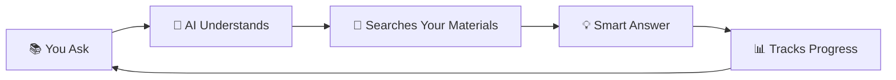

<div align="center">

# 🛡️ S2-Sentinel Copilot

### *Your AI-Powered Study Companion for Cybersecurity Excellence*

**Built for Howest University Belgium 🇧🇪 • CS Engineering Semester 2**

<br>


<br>


</div>

---

## ✨ What Makes S2-Sentinel Special?

Imagine having a **personal AI tutor** that:
- 🧠 **Understands** your specific courses and teaching styles
- 📚 **Learns** from your uploaded study materials
- 🎯 **Adapts** to your learning pace and preferences
- 🛠️ **Provides** 24+ specialized tools for hands-on practice
- 📊 **Tracks** your progress with intelligent analytics
- 🎨 **Looks** stunning with 12 beautiful themes

**S2-Sentinel Copilot isn't just another study app — it's your intelligent study partner!**

---

## 🎓 Your Course Arsenal

<table>
<tr>
<td width="50%">

### 🔵 **Technical Mastery**
- **Computer Networks** (6 ECTS)
  - *Packet-First Learning*
- **Web Backend Development** (3 ECTS)
  - *Code-First Approach*
- **Scripting & Code Analysis** (6 ECTS)
  - *Annotated Code Style*

</td>
<td width="50%">

### 🔴 **Security Expertise**
- **Web Pentesting** (3 ECTS)
  - *Attack-Chain Method*
- **Linux for Ethical Hackers** (6 ECTS)
  - *CLI-First Training*
- **Capture The Flag** (3 ECTS)
  - *Hint-Ladder System*

</td>
</tr>
<tr>
<td colspan="2">

### 🌟 **Professional Skills**
- **Data Privacy & IT Law** (3 ECTS) • *Case-Based Learning*
- **AI Security** (3 ECTS) • *Threat-Model Analysis*

</td>
</tr>
</table>

---

## 🚀 Get Started in 60 Seconds

### Step 1️⃣ : Open the App
```
Simply open index.html in your browser - No installation needed!
```

### Step 2️⃣ : Get Your Free API Key
Choose your AI provider (both are free!):
- 🚄 **[Cerebras](https://cloud.cerebras.ai/)** - Lightning fast (Recommended!)
- 🧠 **[Google AI Studio](https://aistudio.google.com/apikey)** - Powerful & free

### Step 3️⃣ : Start Learning
1. 📖 Select your subject
2. 📄 Upload your study materials (PDFs)
3. 💬 Ask questions and get smart answers
4. 🛠️ Use specialized tools
5. 📊 Track your progress

**That's it! You're ready to ace your exams! 🎯**

---

## 🎨 Beautiful Themes for Every Mood

Choose from **12 stunning themes** that match your vibe:

| 🌟 Premium | 🌈 Colorful | 🌙 Dark | ☀️ Light |
|------------|-------------|---------|-----------|
| Glass (Default) | Cyber | Sentinel-Dark | Light |
| Aurora | Ocean | Midnight | - |
| Nebula | Sunset | Hacker | - |
| - | Forest | - | Lavender |

*Switch themes anytime with one click!*

---

## 💡 Powerful Features

<table>
<tr>
<td width="33%" align="center">

### 🤖 **Smart AI**
Context-aware responses<br>
Upload PDFs for custom learning<br>
Multi-model support

</td>
<td width="33%" align="center">

### 🛠️ **24+ Tools**
Subnet Calculator<br>
JWT Decoder<br>
Regex Tester<br>
*...and many more!*

</td>
<td width="33%" align="center">

### 📊 **Analytics**
Study time tracking<br>
Quiz performance<br>
Weak topic detection

</td>
</tr>
<tr>
<td width="33%" align="center">

### 💬 **Chat System**
Streaming responses<br>
Conversation history<br>
Export chats (JSON/HTML/PDF)

</td>
<td width="33%" align="center">

### 📝 **Smart Quizzes**
4 question types<br>
Spaced repetition<br>
Auto-grading

</td>
<td width="33%" align="center">

### 🎯 **Personalized**
8 teaching styles<br>
Adaptive pedagogy<br>
Your pace, your way

</td>
</tr>
</table>

---

## 🎬 How It Works



1. **You ask** a question about your coursework
2. **AI understands** using advanced prompt engineering
3. **Searches** your uploaded study materials for context
4. **Delivers** a personalized, pedagogically-optimized answer
5. **Tracks** your learning progress automatically

---

## 🏆 Why Students Love It

> *"Finally, an AI that actually understands my study materials!"* ⭐⭐⭐⭐⭐

> *"The tools are exactly what I need for pentesting practice!"* ⭐⭐⭐⭐⭐

> *"Best study companion for cybersecurity students!"* ⭐⭐⭐⭐⭐

---

## 🔥 Latest Updates (v2.0.2)

### ✨ **Premium Design Upgrade**
- 🎨 Stunning glassmorphism header
- 🖼️ Real logo and profile images
- 🌈 Color-coded action buttons
- ✨ Smooth animations everywhere

### 💪 **Smart Features**
- 🔄 Session state persistence (remembers your work!)
- 🎨 Auto-loading syntax highlighter (200+ languages!)
- 💾 Export chats in 3 formats
- 🐛 All bugs squashed!

*[See detailed technical changelog](TECHNICAL.md)*

---

## 📖 Need More Info?

| 📄 Document | 🎯 Purpose |
|-------------|-----------|
| **[TECHNICAL.md](TECHNICAL.md)** | Full technical details & architecture |
| **[HOW_IT_WORKS.md](docs/HOW_IT_WORKS.md)** | System architecture explained |
| **[DEVELOPMENT-PHASES.md](docs/DEVELOPMENT-PHASES.md)** | Complete development journey |

---

## 🎓 About the Creator

<div align="center">

**Muhammad Izaz Haider (MIHx0)**

*Cybersecurity Student @ Howest University Belgium 🇧🇪*  
*Junior DevSecOps & AI Security Engineer @ Damno Solutions*  
*Founder of The PenTrix*

**🎯 Mission**: Helping students master cybersecurity through AI-powered learning

**🚀 Vision**: Making education accessible, personalized, and effective for everyone

</div>

---

## 🔗 Connect With Me

<div align="center">

[](https://www.linkedin.com/in/muhammad-izaz-haider-091639314/)
[](https://github.com/mizazhaider-ceh)
[](https://mizazhaider-ceh.github.io/My-Portfolio/)

</div>

---

## 💬 Support This Project

<div align="center">

If S2-Sentinel helped you ace your exams:

⭐ **Star** this repository to show your support  
🔄 **Share** with fellow cybersecurity students  
💡 **Contribute** improvements or new features  
📣 **Spread** the word in your study groups

### Every star motivates me to build better tools! 🙏

</div>

---

## 📜 License

MIT License — Free to use, modify, and share!

---

<div align="center">


**Built by a cybersecurity student, for cybersecurity students**

*Transform your study sessions from boring to brilliant! 🚀*

### Ready to level up your learning? [Open index.html](#) and start now! ✨

</div>
