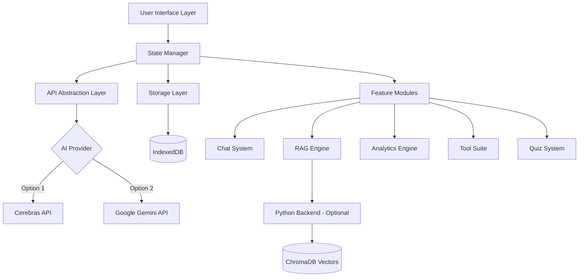

<div align="center">


<br>


<br><br>

**A production-ready solution addressing real-world learning challenges for cybersecurity professionals and students worldwide**

*Originally developed By M Izaz Haider for Howest University Belgium CS Engineering • Now serving global learners*

<br>


<br>


</div>

---

## 🎯 Key Highlights

<table>
<tr>
<td>

**🛠️ Technical Excellence**
- **Full-stack architecture**: Vanilla JavaScript SPA + Python FastAPI backend
- **Hybrid RAG engine**: TF-IDF + ChromaDB vector search + BM25 ranking
- **Real-time streaming**: Server-Sent Events (SSE) for responsive AI interactions
- **Offline-first PWA**: Service worker with intelligent caching strategies
- **Multi-model AI**: Abstraction layer supporting Cerebras (1000+ tokens/sec) & Google Gemini

</td>
<td>

**📊 Engineering Impact**
- Zero external dependencies for core functionality (vanilla JS architecture)
- Modular component system with clear separation of concerns
- IndexedDB for client-side persistence with automatic state management
- Responsive design system with 12 professionally crafted themes
- Built-in analytics engine tracking 15+ learning metrics
- Comprehensive tool suite (24+ utilities) with zero external API dependencies

</td>
</tr>
</table>

> 🚨 **Problem-Solution Fit**

Identified critical pain points in modern cybersecurity education:
- **Context Fragmentation**: Students lose valuable information across multiple AI platforms
- **Generic Responses**: Off-the-shelf AI lacks domain-specific knowledge
- **No Progress Tracking**: Traditional tools provide no learning analytics
- **Scattered Resources**: Course materials exist in silos

**Solution**: A unified, intelligent platform that understands cybersecurity curricula, learns from user materials, and provides course-specific guidance with built-in progress tracking and specialized tools.

---

## 🏗️ Architecture & Features

### 🧠 Core Capabilities

**Intelligent Learning System**
- **Context-Aware AI**: Multi-layer prompt engineering with course-specific knowledge injection
- **RAG Pipeline**: Document processing → Vector embedding → Semantic search → Context synthesis
- **Adaptive Pedagogy**: 8 distinct teaching styles (Socratic, Analogies, Step-by-step, etc.)
- **Progress Analytics**: Real-time tracking of study time, topic coverage, and knowledge gaps

**Developer-Grade Tooling**

24+ built-in utilities covering:
- **Networking**: Subnet calculator, CIDR converter, port reference
- **Security**: JWT decoder, header analyzer, hash identifier
- **Backend**: SQL formatter, API tester, session analyzer
- **Linux**: Permission calculator, cron generator, command reference
- **CTF**: Base converter, cipher tools, encoding utilities
- **Scripting**: Regex tester, JSON validator, diff viewer

**Enterprise Features**
- Multi-format export (JSON/HTML/PDF) with full conversation history
- Theme system with 12 professionally designed color schemes
- Streaming responses with syntax highlighting (200+ languages)
- Session persistence and state recovery
- Offline capability with service worker caching

### Preconfigured Knowledge Domains

**Technical Foundation**: Computer Networks • Web Backend Development • Scripting & Code Analysis

**Security Specialization**: Web Pentesting • Linux for Ethical Hackers • Capture The Flag

**Professional Context**: Data Privacy & IT Law • AI Security

*Custom domains easily configurable via `config-s2.js`*

---

## 🚀 Quick Start

### Prerequisites
- Modern web browser (Chrome 90+, Firefox 88+, Safari 14+)
- API key from [Cerebras](https://cloud.cerebras.ai/) or [Google AI Studio](https://aistudio.google.com/apikey) (both free)

### Installation

**Option 1: Direct Launch** (Zero Installation)
```bash
# Clone repository
git clone https://github.com/mizazhaider-ceh/Sentinel-Copilot-S2.git
cd Sentinel-Copilot-S2

# Open in browser
open index.html  # macOS
start index.html  # Windows
xdg-open index.html  # Linux
```

**Option 2: With RAG Backend** (Enhanced Features)
```bash
# Start Python backend
cd server
python -m venv venv
source venv/bin/activate  # On Windows: venv\Scripts\activate
pip install -r requirements.txt
uvicorn main:app --reload

# Backend runs on http://localhost:8000
```

### Configuration
1. Launch application
2. Navigate to Settings → API Configuration
3. Add your API key (Cerebras recommended for speed)
4. Select your learning domain
5. Upload course materials (optional but recommended)

**System is now ready for production use**

---

## ⚙️ Technical Specifications

### 🌐 Frontend Architecture
- **Framework**: Vanilla JavaScript (zero framework dependencies)
- **Architecture Pattern**: Single Page Application (SPA) with route-based lazy loading
- **State Management**: Custom reactive state manager with pub/sub pattern
- **Storage**: IndexedDB for persistence, localStorage for preferences
- **UI System**: CSS Grid + Flexbox with custom design tokens
- **Theme Engine**: CSS custom properties with 12 pre-built themes (Glass, Aurora, Nebula, Cyber, Ocean, Sunset, Forest, Sentinel-Dark, Midnight, Hacker, Light, Lavender)

### 🐍 Backend Stack (Optional RAG Enhancement)
- **Framework**: FastAPI (Python 3.9+)
- **Vector Database**: ChromaDB with persistent storage
- **Search Algorithm**: Hybrid BM25 + semantic vector search
- **Document Processing**: PyMuPDF for PDF extraction, semantic chunking
- **API Design**: RESTful with OpenAPI documentation

### ⚡ Performance Characteristics
- **Initial Load**: < 500ms (without cached resources)
- **AI Response Time**: 50-200ms first token (Cerebras), streaming thereafter
- **Vector Search**: < 100ms for 10,000 document chunks
- **Offline Capability**: Full functionality except AI queries
- **Memory Footprint**: ~15MB baseline, scales with conversation history

---

## 🔥 The Powerful Combination

<div align="center">


</div>

> **S2-Sentinel isn't just a study tool—it's a convergence of multiple engineering disciplines into one cohesive platform.**

This project represents the intersection of **six distinct technical domains**, each reinforcing the others:

```
┌─────────────────────────────────────────────────────────────────────┐
│                    S2-SENTINEL COPILOT                            │
│     Where Cybersecurity Meets Intelligent Engineering             │
└─────────────────────────────────────────────────────────────────────┘
```

| Domain | Application in S2-Sentinel | Depth |
|--------|---------------------------|-------|
| 🔐 **Cybersecurity Knowledge** | Pre-built prompts for 8 security domains, attack-chain pedagogy, CTF training tools, pentesting utilities | Deep domain expertise |
| 🤖 **AI & RAG Integration** | Hybrid retrieval (TF-IDF + BM25 + ChromaDB vectors), multi-model abstraction (Cerebras + Gemini), streaming SSE, context-aware prompt engineering | Production-grade AI pipeline |
| 🌐 **Full-Stack Web Development** | Vanilla JS SPA (zero dependencies), Python FastAPI backend, RESTful APIs, IndexedDB persistence, service worker PWA | End-to-end engineering |
| 🎨 **UI/UX Design** | 12-theme design system, glassmorphism aesthetics, responsive 320px–4K, accessibility-first, CSS custom properties architecture | Professional-grade design |
| 📋 **Project Management** | 6-phase development roadmap, semantic versioning, modular architecture planning, feature prioritization | Structured delivery |
| 📦 **Software Engineering Practices** | Clean git history (100+ meaningful commits), modular file architecture (46 files), comprehensive documentation, MIT licensing | Industry-standard workflow |

### 💡 Why This Combination Matters

Most student projects demonstrate **one** skill. S2-Sentinel demonstrates the ability to:

1. **Identify a real problem** through user research and personal experience
2. **Architect a scalable solution** with clean separation of concerns
3. **Implement across the full stack** — frontend, backend, AI pipeline, and infrastructure
4. **Deliver production-quality code** with proper documentation and version control
5. **Iterate based on feedback** through multiple development phases (v1.0 → v2.0.2)

This isn't a tutorial project copied from YouTube. It's an **original system** built from scratch to solve a real problem, combining **cybersecurity domain expertise** with **modern software engineering** and **AI integration**.

---

## 📌 System Architecture



**Data Flow**:
1. User query → Prompt builder injects course context
2. RAG engine retrieves relevant document chunks (if available)
3. Unified prompt sent to AI provider via abstraction layer
4. Streaming response rendered with syntax highlighting
5. Conversation stored in IndexedDB with metadata
6. Analytics engine extracts learning metrics asynchronously

---

## 📈 Development Highlights

### Version 2.0.2 (Current Stable) ✅

**UI/UX Enhancements**
- Glassmorphism design system with premium visual aesthetics
- Real-time syntax highlighting supporting 200+ programming languages
- Dynamic theme switcher with smooth CSS transitions
- Responsive grid layout optimized for 320px-4K displays

**Core Functionality**
- Session state persistence with automatic recovery
- Export functionality supporting JSON, HTML, and PDF formats
- Streaming response handling with token-by-token rendering
- Comprehensive error handling and graceful degradation

**Performance Optimizations**
- Lazy-loaded feature modules reducing initial bundle size
- Service worker caching strategy for offline capability
- Debounced auto-save preventing excessive storage operations
- Optimized IndexedDB queries with compound indexes

*Full technical changelog available in [TECHNICAL.md](TECHNICAL.md)*

---

## 💫 Project Genesis

### 💡 How It Started

It began with **[Study Copilot](https://github.com/mizazhaider-ceh/Study-Copilot)**—a personal AI tutor I built to make my own study sessions more productive. It worked. But as Semester 2 at Howest started, I realized the problem was bigger than I thought.

Students were:
- Losing hours switching between ChatGPT, Google, and five different tools
- Forgetting which conversation had the answer they needed
- Getting generic responses from AI that didn't understand their coursework
- Studying without any way to measure progress or identify weak areas

Study Copilot was a good foundation, but Semester 2 needed something **purpose-built**—something that understood the curriculum, had the right tools baked in, and could track your learning journey from day one.

That's when S2-Sentinel Copilot was born.

### ❤️ The Effort Behind It

This project took **significant time and dedication**—countless late nights, debugging sessions, architecture rewrites, and feature iterations. From the first line of code to the 11,707th, every decision was intentional.

**Alhamdulillah**, it's done. And it works.

But more importantly, it was built with a philosophy: **tools should adapt to students, not the other way around.**

---

## 🚀 The Road Ahead

> **S2-Sentinel doesn't stop here.** ♾️

This platform is designed to **evolve**. The modular architecture, clean codebase, and extensible configuration system were built with the future in mind.

**Planned Evolution:**

| Phase | Goal | Status |
|-------|------|--------|
| 🏫 Multi-Semester Support | Expand beyond S2 to cover full degree programs | 📌 Planned |
| 👥 Collaborative Learning | Real-time study rooms and shared notes | 🔍 Researching |
| 🧠 Advanced Analytics | ML-powered study pattern optimization | ✅ Designed |
| 📱 Mobile Application | React Native companion app | 📌 Planned |
| 🏢 Institutional API | University-level deployment and LMS integration | 📐 Architected |
| 🧩 Plugin Marketplace | Community-contributed tools and course packs | 💡 Conceptualized |

**The vision**: From a single-semester study companion to a **comprehensive learning OS** for cybersecurity professionals worldwide.

Every commit brings it closer. Every user's feedback shapes its direction.

---

## 📚 Documentation

| Document | Purpose |
|----------|----------|
| **[TECHNICAL.md](TECHNICAL.md)** | Full technical details, codebase statistics & architecture |
| **[HOW_IT_WORKS.md](docs/HOW_IT_WORKS.md)** | System architecture deep-dive |
| **[DEVELOPMENT-PHASES.md](docs/DEVELOPMENT-PHASES.md)** | Complete 6-phase development journey |

---

## 🤝 Contributors & Collaboration

<div align="center">

### 👨‍💻 Core Team

</div>

**[Muhammad Izaz Haider (MIHx0)](https://github.com/mizazhaider-ceh)** — Creator & Lead Developer
- Designed and implemented the full-stack architecture from scratch
- Built the hybrid RAG engine, AI abstraction layer, and 24+ tool suite
- Managed the complete development lifecycle across 6 phases
- Authored all documentation and technical specifications

**[Masud Rana](https://github.com/masudrana-ceh)** — Contributor & Collaborator
- Proposed key feature ideas that shaped the platform's direction
- Provided critical UX feedback during early development cycles
- Suggested tool selections and interface improvements that improved usability
- Tested features and reported issues that led to stability improvements
- A true collaborator whose perspective helped S2-Sentinel become what it is today

### 🤜🤛 Our Collaboration

S2-Sentinel was built through genuine collaboration. While I (Izaz) handled the engineering, Masud was the sounding board who challenged ideas, suggested better approaches, and kept the user experience honest. The best features in this platform—the tool selection, the intuitive UI flow, the focus on practical utility—came from our discussions about what **we as students actually needed**, not just what looked impressive technically.

Building something together is always better than building alone.

### 🙏 Acknowledgments

- 🏫 **Howest University Belgium** — For the world-class Cybersecurity Engineering program that inspired this project
- ⚡ **Cerebras AI** — For providing lightning-fast inference API (1000+ tokens/sec)
- 🧠 **Google Gemini** — For powerful AI capabilities as a secondary model
- 👥 **Fellow Students** — Beta testers who provided invaluable feedback during development
- 📚 **Open Source Community** — For the libraries and tools that made this possible

---

## 🎓 About the Creator

<div align="center">


</div>

<div align="center">

Cybersecurity Student @ Howest University Belgium 🇧🇪  
Junior DevSecOps & AI Security Engineer @ Damno Solutions  
Founder of The PenTrix

*From a small village in Pakistan 🇵🇰 to the European tech frontier 🇪🇺*

</div>

**Background**: A cybersecurity student who saw a gap between available tools and actual student needs. Instead of waiting for someone else to solve it, I built the solution—twice. First [Study Copilot](https://github.com/mizazhaider-ceh/Study-Copilot), then S2-Sentinel.

**Philosophy**:
> *"If you can't explain it simply, you don't understand it well enough."*  
> Build tools that make complex subjects approachable. Write code that others can read. Ship products that actually solve problems.

---

## 🔗 Connect

<div align="center">

[](https://www.linkedin.com/in/muhammad-izaz-haider-091639314/)
[](https://github.com/mizazhaider-ceh)
[](https://mizazhaider-ceh.github.io/My-Portfolio/)
[](mailto:mizazhaiderceh@gmail.com)

</div>

---

## ⭐ Support & Contributing

If S2-Sentinel has been useful to you:

- ⭐ **Star** this repository to help others discover it
- 🔀 **Fork** and submit PRs for improvements or new features
- 💬 **Open issues** for bugs, feature requests, or curriculum suggestions
- 📣 **Share** with fellow cybersecurity students and professionals

Contributions welcome. See [TECHNICAL.md](TECHNICAL.md) for architecture details before contributing.

---

## 📜 License

MIT License — Free to use, modify, and distribute.

---

<div align="center">


<br>

*From a university problem → To a global solution*

[Get Started](#-quick-start) • [Read the Docs](TECHNICAL.md) • [View Architecture](#-system-architecture)

<br>


</div>

<div align="center">


</div>


