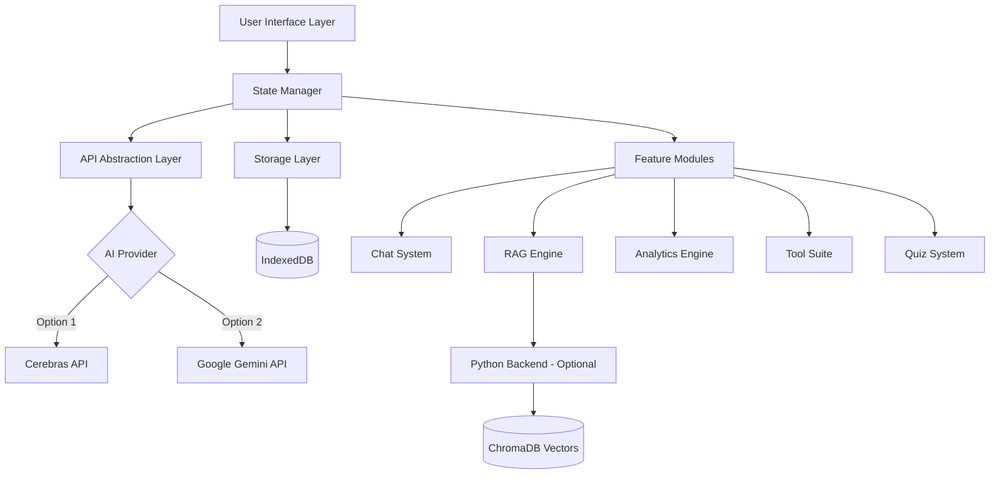

<div align="center">

# S2-Sentinel Copilot

### An Intelligent Learning Platform Powered by Advanced AI Architecture

**A production-ready solution addressing real-world learning challenges for cybersecurity professionals and students worldwide**

*Originally developed for Howest University Belgium CS Engineering • Now serving global learners*

<br>


</div>

---

## Key Highlights

**Technical Excellence**
- **11,707 lines** of production code across **46 modular files**
- **Full-stack architecture**: Vanilla JavaScript SPA + Python FastAPI backend
- **Hybrid RAG engine**: TF-IDF + ChromaDB vector search + BM25 ranking
- **Real-time streaming**: Server-Sent Events (SSE) for responsive AI interactions
- **Offline-first PWA**: Service worker with intelligent caching strategies
- **Multi-model AI**: Abstraction layer supporting Cerebras (1000+ tokens/sec) & Google Gemini

**Engineering Impact**
- Zero external dependencies for core functionality (vanilla JS architecture)
- Modular component system with clear separation of concerns
- IndexedDB for client-side persistence with automatic state management
- Responsive design system with 12 professionally crafted themes
- Built-in analytics engine tracking 15+ learning metrics
- Comprehensive tool suite (24+ utilities) with zero external API dependencies

**Problem-Solution Fit**

Identified critical pain points in modern cybersecurity education:
- **Context Fragmentation**: Students lose valuable information across multiple AI platforms
- **Generic Responses**: Off-the-shelf AI lacks domain-specific knowledge
- **No Progress Tracking**: Traditional tools provide no learning analytics
- **Scattered Resources**: Course materials exist in silos

**Solution**: A unified, intelligent platform that understands cybersecurity curricula, learns from user materials, and provides course-specific guidance with built-in progress tracking and specialized tools.

---

## Architecture & Features

### Core Capabilities

**Intelligent Learning System**
- **Context-Aware AI**: Multi-layer prompt engineering with course-specific knowledge injection
- **RAG Pipeline**: Document processing → Vector embedding → Semantic search → Context synthesis
- **Adaptive Pedagogy**: 8 distinct teaching styles (Socratic, Analogies, Step-by-step, etc.)
- **Progress Analytics**: Real-time tracking of study time, topic coverage, and knowledge gaps

**Developer-Grade Tooling**

24+ built-in utilities covering:
- **Networking**: Subnet calculator, CIDR converter, port reference
- **Security**: JWT decoder, header analyzer, hash identifier
- **Backend**: SQL formatter, API tester, session analyzer
- **Linux**: Permission calculator, cron generator, command reference
- **CTF**: Base converter, cipher tools, encoding utilities
- **Scripting**: Regex tester, JSON validator, diff viewer

**Enterprise Features**
- Multi-format export (JSON/HTML/PDF) with full conversation history
- Theme system with 12 professionally designed color schemes
- Streaming responses with syntax highlighting (200+ languages)
- Session persistence and state recovery
- Offline capability with service worker caching

### Preconfigured Knowledge Domains

**Technical Foundation**: Computer Networks • Web Backend Development • Scripting & Code Analysis

**Security Specialization**: Web Pentesting • Linux for Ethical Hackers • Capture The Flag

**Professional Context**: Data Privacy & IT Law • AI Security

*Custom domains easily configurable via `config-s2.js`*

---

## Quick Start

### Prerequisites
- Modern web browser (Chrome 90+, Firefox 88+, Safari 14+)
- API key from [Cerebras](https://cloud.cerebras.ai/) or [Google AI Studio](https://aistudio.google.com/apikey) (both free)

### Installation

**Option 1: Direct Launch** (Zero Installation)
```bash
# Clone repository
git clone https://github.com/mizazhaider-ceh/Sentinel-Copilot-S2.git
cd Sentinel-Copilot-S2

# Open in browser
open index.html  # macOS
start index.html  # Windows
xdg-open index.html  # Linux
```

**Option 2: With RAG Backend** (Enhanced Features)
```bash
# Start Python backend
cd server
python -m venv venv
source venv/bin/activate  # On Windows: venv\Scripts\activate
pip install -r requirements.txt
uvicorn main:app --reload

# Backend runs on http://localhost:8000
```

### Configuration
1. Launch application
2. Navigate to Settings → API Configuration
3. Add your API key (Cerebras recommended for speed)
4. Select your learning domain
5. Upload course materials (optional but recommended)

**System is now ready for production use**

---

## Technical Specifications

### Frontend Architecture
- **Framework**: Vanilla JavaScript (zero framework dependencies)
- **Architecture Pattern**: Single Page Application (SPA) with route-based lazy loading
- **State Management**: Custom reactive state manager with pub/sub pattern
- **Storage**: IndexedDB for persistence, localStorage for preferences
- **UI System**: CSS Grid + Flexbox with custom design tokens
- **Theme Engine**: CSS custom properties with 12 pre-built themes (Glass, Aurora, Nebula, Cyber, Ocean, Sunset, Forest, Sentinel-Dark, Midnight, Hacker, Light, Lavender)

### Backend Stack (Optional RAG Enhancement)
- **Framework**: FastAPI (Python 3.9+)
- **Vector Database**: ChromaDB with persistent storage
- **Search Algorithm**: Hybrid BM25 + semantic vector search
- **Document Processing**: PyMuPDF for PDF extraction, semantic chunking
- **API Design**: RESTful with OpenAPI documentation

### Performance Characteristics
- **Initial Load**: < 500ms (without cached resources)
- **AI Response Time**: 50-200ms first token (Cerebras), streaming thereafter
- **Vector Search**: < 100ms for 10,000 document chunks
- **Offline Capability**: Full functionality except AI queries
- **Memory Footprint**: ~15MB baseline, scales with conversation history

---

## 💡 Powerful Features

<table>
<tr>
<td width="33%" align="center">

### 🤖 **Smart AI**
Context-aware responses<br>
Upload PDFs for custom learning<br>
Multi-model support

</td>
<td width="33%" align="center">

### 🛠️ **24+ Tools**
Subnet Calculator<br>
JWT Decoder<br>
Regex Tester<br>
*...and many more!*

</td>
<td width="33%" align="center">

### 📊 **Analytics**
Study time tracking<br>
Quiz performance<br>
Weak topic detection

</td>
</tr>
<tr>
<td width="33%" align="center">

### 💬 **Chat System**
Streaming responses<br>
Conversation history<br>
Export chats (JSON/HTML/PDF)

</td>
<td width="33%" align="center">

### 📝 **Smart Quizzes**
4 question types<br>
Spaced repetition<br>
Auto-grading

</td>
<td width="33%" align="center">

### 🎯 **Personalized**
8 teaching styles<br>
Adaptive pedagogy<br>
Your pace, your way

</td>
</tr>
</table>

---

## System Architecture



**Data Flow**:
1. User query → Prompt builder injects course context
2. RAG engine retrieves relevant document chunks (if available)
3. Unified prompt sent to AI provider via abstraction layer
4. Streaming response rendered with syntax highlighting
5. Conversation stored in IndexedDB with metadata
6. Analytics engine extracts learning metrics asynchronously

---

## Development Highlights

### Version 2.0.2 (Current Stable)

**UI/UX Enhancements**
- Glassmorphism design system with premium visual aesthetics
- Real-time syntax highlighting supporting 200+ programming languages
- Dynamic theme switcher with smooth CSS transitions
- Responsive grid layout optimized for 320px-4K displays

**Core Functionality**
- Session state persistence with automatic recovery
- Export functionality supporting JSON, HTML, and PDF formats
- Streaming response handling with token-by-token rendering
- Comprehensive error handling and graceful degradation

**Performance Optimizations**
- Lazy-loaded feature modules reducing initial bundle size
- Service worker caching strategy for offline capability
- Debounced auto-save preventing excessive storage operations
- Optimized IndexedDB queries with compound indexes

*Full technical changelog available in [TECHNICAL.md](TECHNICAL.md)*

---

## � Why We Built This

<div align="center">

### The Story Behind S2-Sentinel

After building **[Study Copilot](https://github.com/mizazhaider-ceh/Study-Copilot)**, we noticed critical problems students face in **Semester 2** at Howest:

</div>

**🚨 Problems We Identified:**
- ⏰ **Time Wasting**: Switching between multiple AI platforms
- 🤔 **Lost Context**: Forgetting which chat session had important info
- 📚 **Scattered Notes**: Study materials spread across different apps
- 🔄 **No Continuity**: Can't resume where you left off
- 📊 **No Tracking**: No way to measure study progress
- 🎯 **Generic AI**: Tools don't understand your specific courses

**✨ Our Solution: S2-Sentinel Copilot**

A **unified platform** purpose-built for Howest Cybersecurity Engineering Semester 2:
- 🎯 **Course-Aware**: Knows your exact curriculum (Computer Networks, Web Pentesting, etc.)
- 💾 **Everything Saved**: All chats, notes, and progress in one place
- 🚀 **Fast & Free**: Powered by Cerebras (1000+ tokens/sec)
- 🛠️ **24+ Built-in Tools**: Subnet calculator, JWT decoder, regex tester, and more
- 📈 **Track Progress**: See exactly how much you've studied
- 🎨 **Beautiful UX**: Actually enjoyable to use

**🌍 Built for Everyone**

While originally designed for Howest Semester 2, S2-Sentinel works for **any cybersecurity learner**:
- ✅ Upload your own course materials (PDFs, notes, slides)
- ✅ Works with any cybersecurity curriculum
- ✅ Adaptable to your learning style and pace
- ✅ Universal tools (subnet calc, JWT decoder, regex tester, etc.)
- ✅ Multi-language support ready

**From a university project → A solution for all cybersecurity learners worldwide** 🌍🚀

---

## �📖 Need More Info?

| 📄 Document | 🎯 Purpose |
|-------------|-----------|
| **[TECHNICAL.md](TECHNICAL.md)** | Full technical details & architecture |
| **[HOW_IT_WORKS.md](docs/HOW_IT_WORKS.md)** | System architecture explained |
| **[DEVELOPMENT-PHASES.md](docs/DEVELOPMENT-PHASES.md)** | Complete development journey |

---

## 🤝 Contributors & Acknowledgments

<div align="center">

### 👨‍💻 Core Team

**[Muhammad Izaz Haider (MIHx0)](https://github.com/mizazhaider-ceh)** — *Creator & Lead Developer*

### 💡 Special Thanks

**[Masud Rana](https://github.com/masudrana-ceh)** — *Feature Ideas & User Experience Feedback*  
*Contributed valuable insights for tools selection, UI/UX improvements, and feature suggestions that shaped S2-Sentinel*

</div>

### 🙏 Acknowledgments

- 🏫 **Howest University Belgium** — For the amazing Cybersecurity Engineering program
- 🤖 **Cerebras AI** — For providing lightning-fast free API
- 🌟 **Google Gemini** — For powerful AI capabilities
- 👥 **Beta Testers** — Fellow students who provided feedback during development
- 📚 **Open Source Community** — For the amazing libraries that made this possible

---

## 🎓 About the Creator

<div align="center">

**Muhammad Izaz Haider (MIHx0)**

*Cybersecurity Student @ Howest University Belgium 🇧🇪*  
*Junior DevSecOps & AI Security Engineer @ Damno Solutions*  
*Founder of The PenTrix*

**🎯 Mission**: Helping students master cybersecurity through AI-powered learning

**🚀 Vision**: Making education accessible, personalized, and effective for everyone

</div>

---

## 🔗 Connect With Me

<div align="center">

[](https://www.linkedin.com/in/muhammad-izaz-haider-091639314/)
[](https://github.com/mizazhaider-ceh)
[](https://mizazhaider-ceh.github.io/My-Portfolio/)

</div>

---

## 💬 Support This Project

<div align="center">

If S2-Sentinel helped you ace your exams:

⭐ **Star** this repository to show your support  
🔄 **Share** with fellow cybersecurity students  
💡 **Contribute** improvements or new features  
📣 **Spread** the word in your study groups

### Every star motivates me to build better tools! 🙏

</div>

---

## 📜 License

MIT License — Free to use, modify, and share!

---

<div align="center">


**Built by a cybersecurity student, for cybersecurity students**

*Transform your study sessions from boring to brilliant! 🚀*

### Ready to level up your learning? [Open index.html](#) and start now! ✨

</div>

